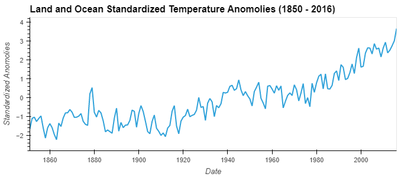
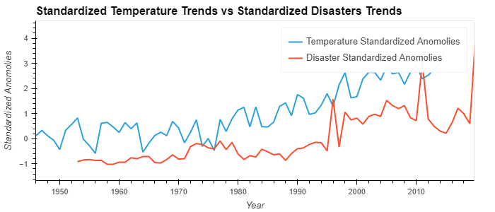
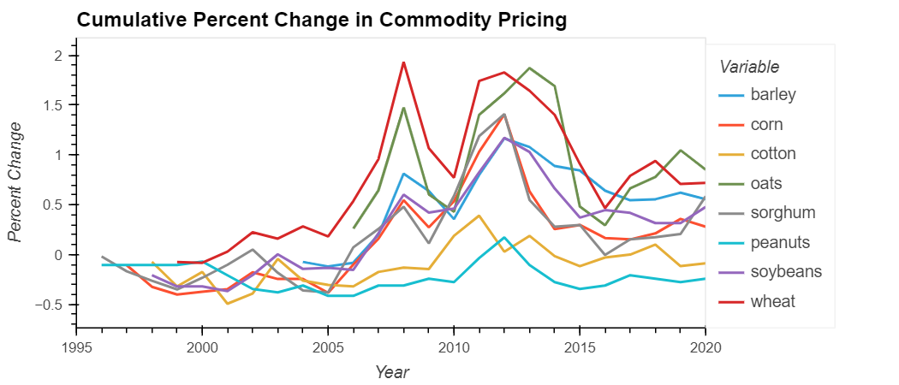
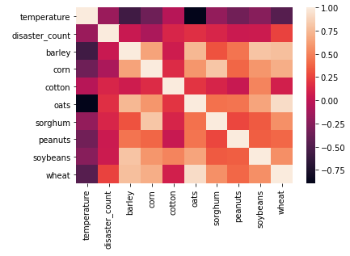

# Climate Change and Extreme Weather Events vs. Commodity Prices
#### UW Fintech - Fall 2021

---

## Description

In this Jupyter Lab Notebook, we anlayze the trends and correlations that climate change and extreme weather events have on commodity pricing.  This project specifically looks at agricultural commodities (US cash crops i.e wheat, barley, corn, cotton etc.).  Historical data for temperature, disaster declarations and commodity pricing will be used in this anlaysis.

The analysis is broken up in to four sections: 

1. Climate Analysis
2. Natural Disasters in the United States Analysis
3. Commodity Price Analysis
4. Conclusion 

---

## Data Sources

The sources of data are as follows:

* [Climate Data](https://www.kaggle.com/berkeleyearth/climate-change-earth-surface-temperature-data) - Data gathered from Berkley Earth, Lawrence Berkley        National Laboratory. 

* [USA Natural Disaster Declarations](https://www.kaggle.com/headsortails/us-natural-disaster-declarations) - Data gathered from the Federal Emergency Management Agency (FEMA)

* [Commodity Pricing](https://www.ers.usda.gov/data-products/commodity-costs-and-returns/) - Data gathered from US Department of Agriculture (USDA)

---

 ## Executive Summary

It’s a well known fact that climate is a “hot” topic in the news and politics today.  There are many opinions floating around, but what are the facts and what are the actual consequences?  The intent of our project is to evaluate the effects that climate change and extreme weather events have on commodity pricing.  This project specifically looks at agricultural commodities (US cash crops i.e wheat, barley, corn, cotton etc.)   After further analysis we will provide a conclusion summarizing our findings on climate events and its impact on commodities.

---

## Analysis and Conclusion Overview

Refer to the Jupyter Lab notebook for a more detailed view of the analysis, but a summary of the analysis can be seen in the following: 

### Climate Analysis
The following screenshot shows the general warming trend of global land and ocean annual temperatures of the time period analyzed.  The units on the y-axis are in standard devations from the mean.



As seen for the temperature analysis, there is a warming trend occuring that began to increase slightly around 1920 and then the trend of warming significantly increased around 1980.  

When comparing this to a standard "Normal Distribution" curve, we can determine that this warming trend is very substantial and does not follow the rules of what one would supsect of normal distribution probability.  For example, beginning in 2014 the temperature anomolies began to deviate by more than 3 standard devation units from the normal average temperature mean.  A normal distribution curve indicates that the "odds" of this ocurring are less than 0.1% and by the way the devations have been trending since 1980, it does not look like this warming trend will be slowing down.  This is assuming that temperature and climate follow normal distribution laws. 

### Natural Disasters in the United States Analysis
A overlay of temperature anomolies vs USA natural disaster anomolies from 1960 onwards can be seen in the following screenshot: 



It can be seen that although disasters seems to be more sparatic in it's anomolies when compared to temperature, there is an upward trend in both of the datasets analyzed.  Because the disaster dataset is smaller, it is important to note that the earlier data could provide us with more insights into the comparisons, but for now we will have to work with the information at hand.  

Again, we can determine that this disaster trend is very substantial and does not follow what you would expect from normal distribution probability.  For example, in 2020 the disaster anomolies deviate by more than 4 standard devation units from the normal average disaster mean.  A normal distribution curve indicates that the "odds" of this ocurring are less than 0.1% and by the way the devations have been trending since 1990, it appears that this trend may be on the increase. Again, this analysis is made by assuming that natural disaster trends follow a normal distribution laws.

### Commodity Price Analysis
A plot showing cumlative product on percent change can be seen for the commodites anlayzed.   


It is more difficult to determine general trends for commodites as opposed to temperature and disaster declarations. 

Looking into the spike and following crash in 2008, we can find through additional research that much like the housing markets, there was a commoditie bubble being bolstered by speculative derivative trading in the commodity markets.  To add insult to injury, the commodity bubble burst shortly after the housing market recession which caused additional finanical loss for the world.  This commodity bubble was mainly due to oil which is not analyzed in this project but you can see that other commodities were still affected. 

We can also see that there was a spike and following crash in 2012.  This is said to be due to the fact that the Chinese market demand for commodites was lessening over this time period resulting in a overall drop in demand, and therefore pricing.  

### Conclusion

By reviewing the following correlation table, we can look at the year-to-year correlation values between temperature, disasters and commodities.



### Temperature vs Disaster Count

There is low inverse correlation between the year to year values for temperature and disaster count.  Although we can easily compare the year to year correlation, it would be interesting to investigate this relationship further because there may be a delayed correlation, or potentially the increase in temperature could cause more volatility but not necessarily a direct increase in number of disasers.  I was surprised by this correlation due to the the general trend analyzed above that showed both temepratures and number of disasters increasing over the data analyzed.

### Temperature vs Commodity Pricing

There is a medium to large inverse relationship between temeperature and commodities pricing.  This may have been the most surprising relationship noted becuase it may suggest that rising temperatures actually can cause the pricing of commodities to decrease.  This begs the question of correlation vs causation.  As discussed above, some of the peaks and dips noted were caused by global economic issues rather than climate but some of these correlations are so high that it would be foolish not look into more, specifically for oats with a correlation of -0.89.   

### Disaster Count vs Commodity Pricing
Comparing disaster count and commodity pricing, we see that the correlation is low for all of the commodities.  The two highest correlations out of the commodities analyzed are are wheat and oats (.26 and .18, respectivley). 

In conclusion, we can say that rising temperatures and increased frequency of natural disasters will have economic consequences, although, at this point in our analysis, we cannot confidently state the scale or timing of when these consequence will occur in regards to disasters and commodity pricing.  Based off the year-to-year correlation analysis, it appears that rising temperature will actually lower the cost of commodity pricing so one might make a financial decision to sell derivatives on commodities (especially oats, barley and wheat with a correlation of -0.89, -0.57 and -0.46, respectivley) when there is a large in increase temperature.  Although, it is important to keep in mind that economic events such as demand and financial markets also play a role in pricing as well as the effects of temperature changes.  It would be extremely interesting to further this investigation and gather more data regarding commodity prices when compared to demand, financial markets and other factors.  

The general trend between temperature and disaster count was interesting because although correlation was low year-to-year, the overall trend was very noticeable.  Number of disasters and economic damages would also be an interesting topic to further investigate because based off our analysis, the trend is increasing very quickly.  

If this analysis was to continue, it would be important to find larger datasets, specifcally for commodities.  The more information we have, the more confidence we will have in our results.  It would also be interesting to investigate disasters worldwide as our analysis was focused on the USA.    

---

## Technologies

This project leverages JupyterLab Version 3.0.14 in association with Anaconda distribution and the Conda package manager.  The following packages are also used: 

* [pandas](https://github.com/pandas-dev/pandas) - Data analysis toolkit for Python.

* [hvPlot](https://github.com/holoviz/hvplot) - A high-level plotting API for the PyData ecosystem built on HoloViews.

* [seaborn](https://github.com/mwaskom/seaborn) - A visualization tool providing a high-level interface for drawing statistical graphics.

---

## Installation

Before running the application, install Python modules Pandas and hvPlot:

```python

  conda install pandas

  conda install -c pyviz hvplot

```
 
---

## Contributors

Joshua Creveling - josh.creveling22@gmail.com

Athit Padmasuta - padmasuta78@gmail.com

Will Dittig - dittigwill@gmail.com

---

## License

MIT
